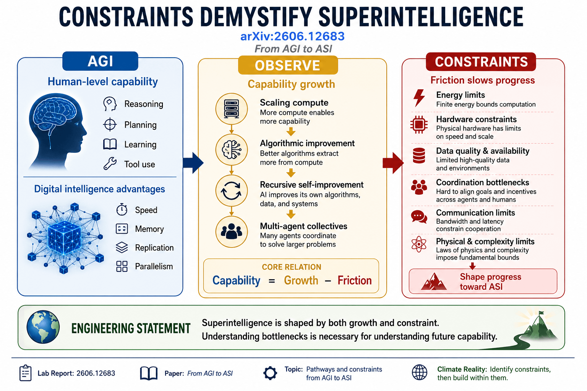

# agi-vs-asi

<p align="center">
  
</p>

Lab reports and notebooks exploring pathways, constraints, and forecasts for transitions from AGI to ASI.

Based on:

- arXiv:2606.12683
- Engineering statement: *Constraints Demystify Superintelligence*

## Core statement

> The transition from artificial general intelligence (AGI) to artificial superintelligence (ASI) depends not only on increasing capability, but also on the constraints that shape scaling, feedback lifts, and coordination.

> The transition from artificial general intelligence (AGI) to artificial superintelligence (ASI) depends not only on increasing capability, but also on the constraints that shape scaling, feedback lifts, and coordination.

## Notebook roadmap

| Notebook | Description | Colab |
|---|---|---|
| `00_context.ipynb` | Paper metadata, engineering statement, vocabulary, growth pathways, constraints, forecasting questions, and roadmap. | [](https://colab.research.google.com/github/thinkthoughts/agi-vs-asi/blob/main/notebooks/00_context.ipynb) |
| `01_AGI_vs_ASI.ipynb` | Clarify AGI, ASI, and Universal AI. | [](https://colab.research.google.com/github/thinkthoughts/agi-vs-asi/blob/main/notebooks/01_AGI_vs_ASI.ipynb) |
| `07_digital_advantages.ipynb` | Speed, memory, replication, sharing, and parallelism. | [](https://colab.research.google.com/github/thinkthoughts/agi-vs-asi/blob/main/notebooks/07_digital_advantages.ipynb) |
| `13_scaling_compute.ipynb` | Compute, data, hardware, inference, and effective compute growth. | [](https://colab.research.google.com/github/thinkthoughts/agi-vs-asi/blob/main/notebooks/13_scaling_compute.ipynb) |
| `17_algorithmic_progress.ipynb` | Algorithmic efficiency, paradigm evolution, test-time scaling, and agent systems. | [](https://colab.research.google.com/github/thinkthoughts/agi-vs-asi/blob/main/notebooks/17_algorithmic_progress.ipynb) |
| `23_feedback_lifts.ipynb` | Code, data, evaluation, hardware, and coordination as feedback lifts on future capability. | [](https://colab.research.google.com/github/thinkthoughts/agi-vs-asi/blob/main/notebooks/23_feedback_lifts.ipynb) |
| `29_multi_agent_collectives.ipynb` | Collective intelligence, specialization, coordination, and agent organizations. | [](https://colab.research.google.com/github/thinkthoughts/agi-vs-asi/blob/main/notebooks/29_multi_agent_collectives.ipynb) |
| `31_constraints_and_bottlenecks.ipynb` | Energy, data, hardware, evaluation, coordination, economics, and physical limits. | [](https://colab.research.google.com/github/thinkthoughts/agi-vs-asi/blob/main/notebooks/31_constraints_and_bottlenecks.ipynb) |
| `37_forecasting_progress.ipynb` | Indicators, scenarios, signal versus noise, and forecast updating. | [](https://colab.research.google.com/github/thinkthoughts/agi-vs-asi/blob/main/notebooks/37_forecasting_progress.ipynb) |
| `43_next_steps.ipynb` | Dashboard ideas, future lab reports, repo extensions, and next actions. | [](https://colab.research.google.com/github/thinkthoughts/agi-vs-asi/blob/main/notebooks/43_next_steps.ipynb) |

## Progression

```text
AGI
    ↓
Digital Advantages
    ↓
Scaling Compute
    ↓
Algorithmic Progress
    ↓
Feedback Lifts
    ↓
Multi-Agent Collectives
    ↓
Constraints and Bottlenecks
    ↓
Forecasting Progress
    ↓
Next Steps
```

## Working equation

```text
capability = growth - friction
```

## Key concepts

- AGI
- ASI
- Digital Advantages
- Effective Compute
- Algorithmic Progress
- Feedback Lifts
- Multi-Agent Collectives
- Constraints
- Forecasting

## Related

- Paper: https://arxiv.org/abs/2606.12683
- PDF: https://arxiv.org/pdf/2606.12683
- Engineering Statements: https://github.com/thinkthoughts/engineering-statements
